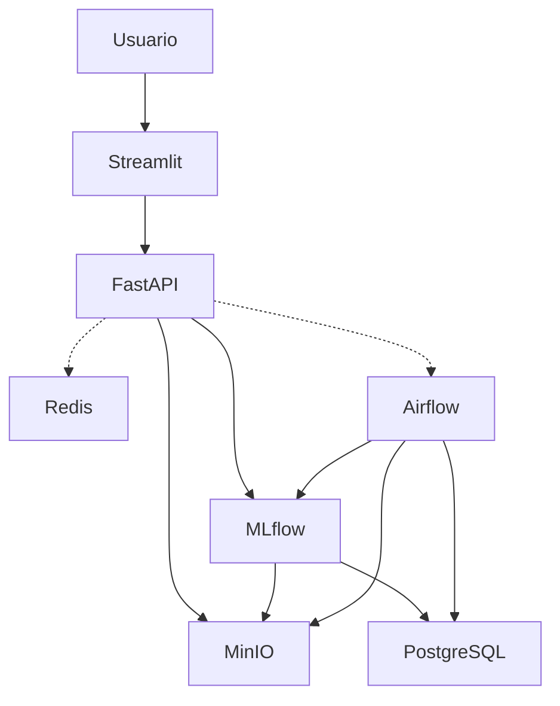

# Operaciones de Aprendizaje de Máquina I (CEIA-MLOps1)

**Profesores:**  
Facundo Adrián Lucianna - facundolucianna@gmail.com

## Integrantes

- a1721 Dimas Ignacio Torres (dimaciodimacio@gmail.com)
- a1726 Joaquín Matías Mestanza (joa.mestanza@gmail.com)
- a1714 Ramiro Andrés Feichubuinm (ra.feichu@gmail.com)

## Descripción del Proyecto

Este proyecto desarrolla un pipeline completo de machine learning para la predicción de precios de apertura de acciones, utilizando datos históricos descargados automáticamente desde Yahoo Finance. El flujo de trabajo está completamente orquestado con Airflow, permitiendo la automatización de tareas de extracción, procesamiento, entrenamiento y evaluación de modelos.

El modelo principal es una red neuronal LSTM, entrenada para predecir el precio de apertura de una acción (por defecto NVDA), aunque es fácilmente configurable para otros activos. El tracking de experimentos y gestión de modelos se realiza con MLflow, mientras que los artefactos y modelos entrenados se almacenan en MinIO, compatible con S3.

El sistema expone una API REST desarrollada en FastAPI, que permite realizar predicciones en tiempo real utilizando el modelo más reciente. Además, se provee una interfaz web en Streamlit para la visualización de resultados y consumo de predicciones de manera sencilla e interactiva.

Toda la infraestructura se despliega mediante Docker Compose, integrando servicios como MLflow, MinIO, PostgreSQL, Airflow, FastAPI, Redis y Streamlit, facilitando la reproducibilidad y escalabilidad del entorno de desarrollo y producción.

## Como correr el proyecto

Estando en root correr:

```
docker-compose up --build
```

## Rutas útiles

- **MLflow:** [http://localhost:5001](http://localhost:5001)
- **MinIO (Bucket):** [http://localhost:9001](http://localhost:9001)
- **Airflow:** [http://localhost:8080](http://localhost:8080)
- **Airflow API Docs:** [http://localhost:8080/api/v1/ui/](http://localhost:8080/api/v1/ui/)
- **FastAPI:** [http://localhost:8000](http://localhost:8000)
- **Streamlit:** [http://localhost:8501](http://localhost:8501)

## Arquitectura de Contenedores

El proyecto utiliza Docker Compose para orquestar los siguientes servicios:

- **MLflow**: Tracking de experimentos y almacenamiento de modelos ([http://localhost:5001](http://localhost:5001))
- **MinIO (Bucket)**: Almacenamiento de artefactos S3 compatible ([http://localhost:9001](http://localhost:9001))
- **PostgreSQL (MLflow y Airflow)**: Bases de datos para MLflow y Airflow
- **Airflow**: Orquestador de pipelines de entrenamiento y evaluación ([http://localhost:8080](http://localhost:8080))
- **FastAPI**: API REST para predicción de precios ([http://localhost:8000](http://localhost:8000))
- **Redis**: Almacenamiento temporal de credenciales para autenticación
- **Streamlit**: Interfaz web para visualización y consumo de predicciones ([http://localhost:8501](http://localhost:8501))

### Diagrama de servicios



## Resumen del trabajo realizado

- Se implementó un DAG en Airflow que posee dos partes: entrenamiento y evaluación.
  Este DAG interactúa con MLFLow para registrar datos del experimento y se asegura de que se guarden los archivos necesarios del modelo para luego realizar una inferencia. Los datos son guardados por medio de un Bucket MinIO.

  Estos entrenamientos en Airflow tienen la posibilidad de ser scheduleados, es decir que podriamos correr el entrenamiento diariamente (después de que la cotización del día ya se sabe).

- Se implementó una API ([README 🔗](./api/README.md)) con FastAPI con los endpoints:

  - `/login`: Autenticación con Airflow (default: `admin admin`).
    Si la autenticación es exitosa, el endpoint devuelve un JWT Token el cual actúa como llave en una base de Redis cuyo valor son las credenciales (con TTL de 60 minutos).
    De esta manera, al obtener el token uno puede seguir seguir haciendo peticiones a Airflow por medio de esta API.

  - `/trigger-new-dag-run`: Apuntamos a un dag en específico para correr en airflow.

  - `/predict-sample`: Llamamos a nuestro mejor entrenamiento según fecha, la métrica y el nombre de la acción seleccionada.

- Streamlit para observar los datos históricos y de nuestras predicciones.

## Mejoras aplicables en un entorno profesional

- Manejo de dependencias. Actualmente las dependencias no tienen versión fija, por lo cual siempre consiguen el `latest` que sea compatible con las otras que ya poseemos. Esto no es ideal ya que podría llegar a romper el proyecto.

- Crear usuarios con roles separados para automatizaciones.
- Cambiar credenciales de usuario admin por defecto.
- Utilizar Redis para servir los datos de Yahoo Finance (esto sirve tanto para los entrenamientos como para los usuarios).
