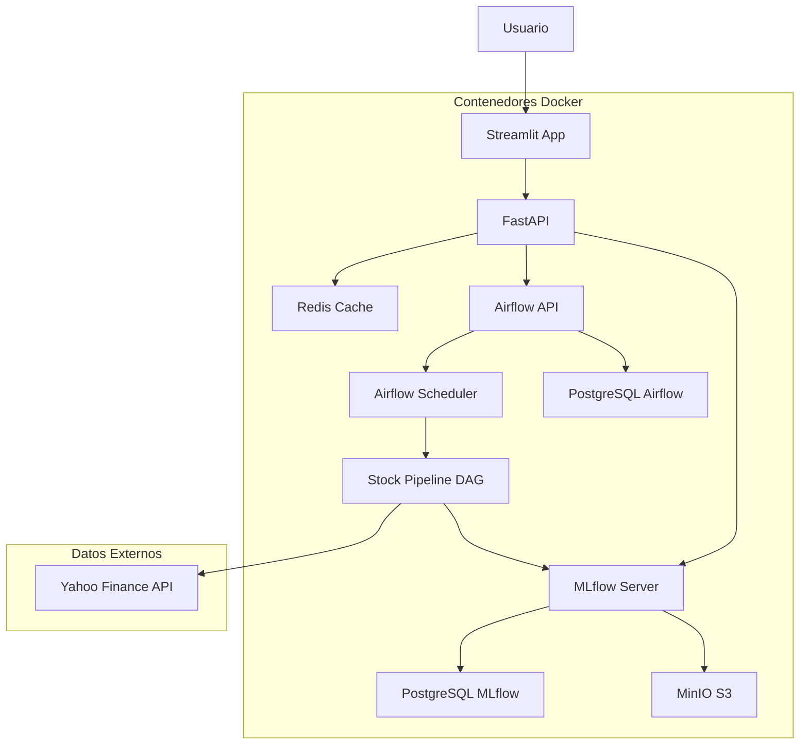

# Operaciones de Aprendizaje de Máquina I (CEIA-MLOps1)

**Profesores:**  
Facundo Adrián Lucianna - facundolucianna@gmail.com

## Integrantes

- a1721 Dimas Ignacio Torres (dimaciodimacio@gmail.com)
- a1726 Joaquín Matías Mestanza (joa.mestanza@gmail.com)
- a1714 Ramiro Andrés Feichubuinm (ra.feichu@gmail.com)

## Descripción del Proyecto

Este proyecto implementa una **plataforma completa de MLOps** para la predicción de precios de apertura de acciones utilizando modelos de deep learning. La solución integra múltiples componentes de la industria para crear un pipeline end-to-end robusto y escalable.

### Características Principales

- **Pipeline de ML Automatizado**: Entrenamiento automático de modelos LSTM usando Apache Airflow
- **Gestión Avanzada de Experimentos**: Tracking completo con MLflow, incluyendo métricas, parámetros y versionado de modelos
- **Almacenamiento Distribuido**: MinIO (S3-compatible) para artefactos y modelos
- **API REST Robusta**: FastAPI con autenticación JWT, validación de datos y manejo de errores
- **Interfaz de Usuario Interactiva**: Streamlit para visualización y predicciones en tiempo real
- **Arquitectura Basada en Microservicios**: Despliegue completo con Docker Compose
- **Seguridad Integrada**: Autenticación con tokens JWT y almacenamiento temporal en Redis

### Tecnologías Utilizadas

- **Orquestación**: Apache Airflow 2.9.2
- **ML Framework**: TensorFlow 2.16.1, Keras 3.9.0
- **Experiment Tracking**: MLflow 2.12.2
- **API Framework**: FastAPI con validación Pydantic
- **Frontend**: Streamlit
- **Bases de Datos**: PostgreSQL (para Airflow y MLflow)
- **Cache**: Redis
- **Almacenamiento**: MinIO (S3-compatible)
- **Containerización**: Docker & Docker Compose

## Instalación y Ejecución

### Requisitos Previos

- Docker
- Docker Compose
- 8GB RAM mínimo recomendado

### Pasos para Ejecutar

1. **Clonar el repositorio**:

   ```bash
   git clone <repository-url>
   cd TP-AdM2
   ```

2. **Configurar variables de entorno**:
   Crea un archivo `.env`:

   ```bash
    MINIO_ROOT_USER=minioadmin
    MINIO_ROOT_PASSWORD=minioadmin
    PG_USER=mlflow
    PG_PASSWORD=mlflowpass
    PG_DATABASE=mlflow_db
    MLFLOW_BUCKET_NAME=mlflow-bucket
    AIRFLOW_DB_USER=airflow
    AIRFLOW_DB_PASSWORD=airflow
    AIRFLOW_DB_NAME=airflow
    AIRFLOW_SECRET_KEY=some-key
   ```

3. **Ejecutar la aplicación**:

   ```bash
   docker-compose up --build
   ```

4. **Verificar servicios**:
   - Esperar ~2-3 minutos para que todos los servicios inicien
   - Verificar logs con `docker-compose logs -f`

### Servicios y Puertos

| Servicio      | URL                                            | Descripción                   | Credenciales          |
| ------------- | ---------------------------------------------- | ----------------------------- | --------------------- |
| **Streamlit** | [http://localhost:8501](http://localhost:8501) | Interfaz principal de usuario | admin/admin           |
| **FastAPI**   | [http://localhost:8000](http://localhost:8000) | API REST y Swagger UI         | -                     |
| **Airflow**   | [http://localhost:8080](http://localhost:8080) | Orquestador de pipelines      | admin/admin           |
| **MLflow**    | [http://localhost:5001](http://localhost:5001) | Tracking de experimentos      | -                     |
| **MinIO**     | [http://localhost:9001](http://localhost:9001) | Consola de almacenamiento     | minioadmin/minioadmin |

### Primer Uso

1. **Acceder a Streamlit**: [http://localhost:8501](http://localhost:8501)
2. **Hacer login** con credenciales de Airflow: `admin` / `admin`
3. **Entrenar un modelo** para el ticker deseado (ej: NVDA, AAPL, TSLA)
4. **Realizar predicciones** una vez completado el entrenamiento

## Arquitectura del Sistema

### Diagrama de Servicios



### Componentes Principales

#### 1. **Pipeline de Entrenamiento (Airflow DAG)**

- **Extracción de Datos**: Descarga automática desde Yahoo Finance
- **Preprocesamiento**: Normalización y creación de secuencias temporales
- **Entrenamiento**: Modelo LSTM con arquitectura configurable
- **Evaluación**: Métricas de rendimiento (RMSE, MAE, R²)
- **Registro**: Almacenamiento automático en MLflow

#### 2. **API REST (FastAPI)**

- **Autenticación JWT**: Integración con credenciales de Airflow
- **Gestión de Modelos**: Selección automática del mejor modelo por métrica
- **Predicciones**: Endpoints para inferencia en tiempo real
- **Validación**: Esquemas Pydantic para validación de datos
- **Documentación**: Swagger UI automática

#### 3. **Interfaz de Usuario (Streamlit)**

- **Dashboard Interactivo**: Visualización de datos y predicciones
- **Gestión de Entrenamientos**: Trigger de nuevos modelos
- **Monitoreo**: Estado de experimentos y métricas

#### 4. **Gestión de Experimentos (MLflow)**

- **Tracking**: Registro automático de métricas, parámetros y artefactos
- **Versionado**: Control de versiones de modelos
- **Comparación**: Análisis comparativo de experimentos
- **Deployment**: Gestión de modelos en producción

### Flujo de Datos

1. **Entrenamiento**:

   ```
   Airflow DAG → Yahoo Finance → Preprocessing → LSTM Training → MLflow Registry
   ```

2. **Predicción**:

   ```
   Streamlit → FastAPI → MLflow Model → Yahoo Finance → Prediction Result
   ```

3. **Autenticación**:
   ```
   User Login → Airflow Validation → JWT Token → Redis Cache → Authorized Requests
   ```

## Funcionalidades Implementadas

### 1. **Pipeline de Entrenamiento Automatizado**

#### Airflow DAG: `stock_prediction_pipeline`

- **Programación**: Ejecución manual o programada
- **Configuración Dinámica**: Parámetro `ticker` configurable
- **Dos Fases**:
  - **Entrenamiento**: Descarga de datos, preprocesamiento y entrenamiento LSTM
  - **Evaluación**: Validación del modelo y registro de métricas

#### Características del Modelo LSTM

- **Arquitectura**: 2 capas LSTM (50 unidades c/u) + Dropout (0.2)
- **Ventana Temporal**: 60 días históricos para predicción
- **Normalización**: MinMaxScaler para estabilidad numérica
- **Métricas**: MSE, MAE, RMSE, R²

### 2. **API REST Completa**

#### Endpoints Principales

```http
POST /login
# Autenticación con credenciales de Airflow
# Retorna: JWT token válido por 60 minutos

POST /trigger-new-dag-run
# Inicia entrenamiento para un ticker específico
# Requiere: JWT token + ticker symbol

POST /predict-sample
# Realiza predicción de precio de apertura
# Requiere: ticker, fecha, métrica de selección de modelo
```

#### Características Avanzadas

- **Autenticación JWT**: Integración con credenciales de Airflow
- **Validación Robusta**: Esquemas Pydantic para validación de entrada
- **Selección Inteligente**: Mejor modelo basado en métricas (RMSE, MAE, R²)
- **Manejo de Errores**: Respuestas HTTP detalladas y logging comprehensivo
- **Documentación Automática**: Swagger UI en `/docs`

### 3. **Interfaz de Usuario Interactiva**

#### Streamlit Dashboard

- **Autenticación Integrada**: Login con credenciales de Airflow
- **Gestión de Modelos**:
  - Entrenamiento de nuevos modelos por ticker
  - Monitoreo de estado de entrenamientos
- **Predicciones en Tiempo Real**:
  - Selección de ticker y fecha
  - Elección de métrica para selección de modelo
  - Visualización de resultados

#### Experiencia de Usuario

- **Interfaz Intuitiva**: Formularios simples y retroalimentación clara
- **Manejo de Errores**: Mensajes de error informativos
- **Estados de Carga**: Indicadores de progreso para operaciones

### 4. **Gestión Avanzada de Experimentos**

#### MLflow Integration

- **Tracking Automático**: Registro de métricas, parámetros y artefactos
- **Organización**: Experimentos separados para entrenamiento y evaluación
- **Versionado**: Control de versiones automático de modelos
- **Comparación**: Análisis comparativo de rendimiento

#### Almacenamiento de Artefactos

- **MinIO S3**: Almacenamiento distribuido de modelos y scalers
- **Persistencia**: Datos preservados entre reinicios
- **Acceso Programático**: APIs para descarga de modelos

### 5. **Seguridad y Autenticación**

#### Sistema de Autenticación

- **JWT Tokens**: Autenticación stateless y segura
- **Integración Airflow**: Validación contra credenciales existentes
- **Cache Temporal**: Redis para almacenamiento de sesiones (TTL 60 min)
- **Headers Estándar**: `Authorization: Bearer <token>`

#### Configuración de Seguridad

- **Secretos Configurables**: Variables de entorno para claves JWT
- **Validación Robusta**: Verificación de tokens en cada request
- **Expiración Automática**: Tokens con tiempo de vida limitado

## Consideraciones Técnicas

### Rendimiento y Optimización

#### Modelo LSTM

- **Epochs**: Configurado en 2 para desarrollo (aumentar para producción)
- **Batch Size**: 32 para balance entre velocidad y precisión
- **Ventana Temporal**: 60 días para capturar patrones estacionales
- **Dropout**: 0.2 para prevenir overfitting

#### Escalabilidad

- **Caching**: Redis para autenticación y futuras optimizaciones
- **Almacenamiento**: MinIO para escalabilidad horizontal
- **Bases de Datos**: PostgreSQL con configuración optimizada
- **Containerización**: Docker para portabilidad y escalabilidad

### Limitaciones Actuales

1. **Datos de Entrenamiento**: Limitado a Yahoo Finance (gratuito)
2. **Modelos**: Solo LSTM (extensible a otros algoritmos)
3. **Frecuencia**: Predicciones diarias (no intraday)
4. **Validación**: Backtesting simple (no walk-forward)

## Mejoras para Entorno Profesional

### 1. **Seguridad y Autenticación**

- [ ] Implementar OAuth2 con proveedores externos (Google, Microsoft)
- [ ] Roles y permisos granulares (admin, analyst, viewer)
- [ ] Rotación automática de claves JWT
- [ ] Auditoría de accesos y operaciones
- [ ] HTTPS con certificados SSL/TLS

### 2. **Gestión de Dependencias**

- [ ] Versionado fijo de dependencias (`requirements.txt` con versiones exactas)
- [ ] Imágenes Docker base versionadas
- [ ] Dependabot para actualizaciones automáticas
- [ ] Vulnerability scanning en CI/CD

### 3. **Infraestructura y Escalabilidad**

- [ ] Kubernetes para orquestación en producción
- [ ] Load balancing para alta disponibilidad
- [ ] Monitoreo con Prometheus + Grafana
- [ ] Alertas automáticas por Slack/Teams
- [ ] Backup automático de bases de datos

### 4. **Calidad de Datos y Modelos**

- [ ] Validación de calidad de datos de entrada
- [ ] Detección de drift en datos y modelos
- [ ] A/B testing para nuevos modelos
- [ ] Reentrenamiento automático basado en performance
- [ ] Métricas de negocio (Sharpe ratio, máximo drawdown)

### 5. **Observabilidad y Monitoreo**

- [ ] Logging estructurado (ELK Stack)
- [ ] Trazabilidad distribuida (Jaeger/Zipkin)
- [ ] Métricas de performance de modelos
- [ ] Dashboards de negocio en tiempo real
- [ ] SLAs y SLOs definidos

### 6. **Fuentes de Datos**

- [ ] Integración con Bloomberg API, Alpha Vantage
- [ ] Datos de sentimiento de noticias
- [ ] Datos macroeconómicos
- [ ] Cache distribuido para datos de mercado
- [ ] Streaming de datos en tiempo real

### 7. **MLOps Avanzado**

- [ ] Feature stores para reutilización
- [ ] Pipelines de CI/CD para modelos
- [ ] Automated model testing
- [ ] Canary deployments para modelos
- [ ] Model governance y compliance

## Solución de Problemas

### Problemas Comunes

#### 1. **Servicios no inician correctamente**

```bash
# Verificar logs
docker-compose logs -f [service-name]

# Reiniciar servicios específicos
docker-compose restart [service-name]

# Limpiar y reconstruir
docker-compose down -v
docker-compose up --build
```

#### 2. **Error de memoria insuficiente**

```bash
# Aumentar memoria Docker (Mac/Windows)
# Docker Desktop > Settings > Resources > Memory > 8GB+

# Verificar uso de memoria
docker stats
```

#### 3. **Problemas de conectividad entre servicios**

```bash
# Verificar red Docker
docker network ls
docker network inspect tp-adm2_ml_pipeline_net

# Verificar puertos
docker-compose ps
```

#### 4. **Errores de autenticación**

- Verificar credenciales Airflow: `admin`/`admin`
- Comprobar token JWT en headers
- Revisar logs de Redis para sesiones

#### 5. **Modelos no encontrados**

- Verificar que el entrenamiento se completó exitosamente
- Comprobar experimentos en MLflow UI
- Verificar ticker exacto (case-sensitive)

### Comandos Útiles

```bash
# Ver logs en tiempo real
docker-compose logs -f

# Ejecutar comandos dentro de contenedores
docker-compose exec api bash
docker-compose exec airflow-webserver bash

# Verificar estado de servicios
docker-compose ps

# Reiniciar un servicio específico
docker-compose restart streamlit

# Limpiar volúmenes (¡CUIDADO: Borra datos!)
docker-compose down -v
```

## Licencia

Este proyecto es desarrollado con fines educativos para el curso de MLOps I de la Carrera de Especialización en Inteligencia Artificial (CEIA).
